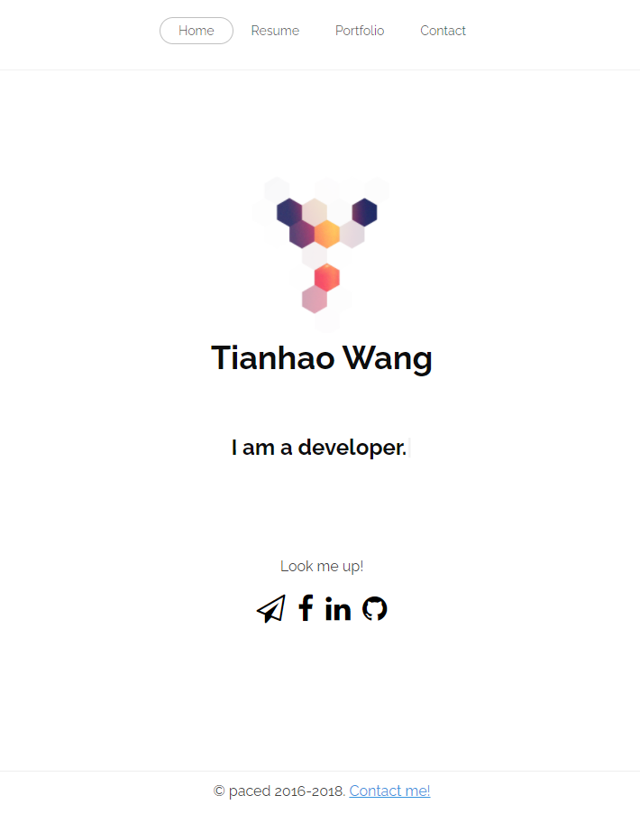
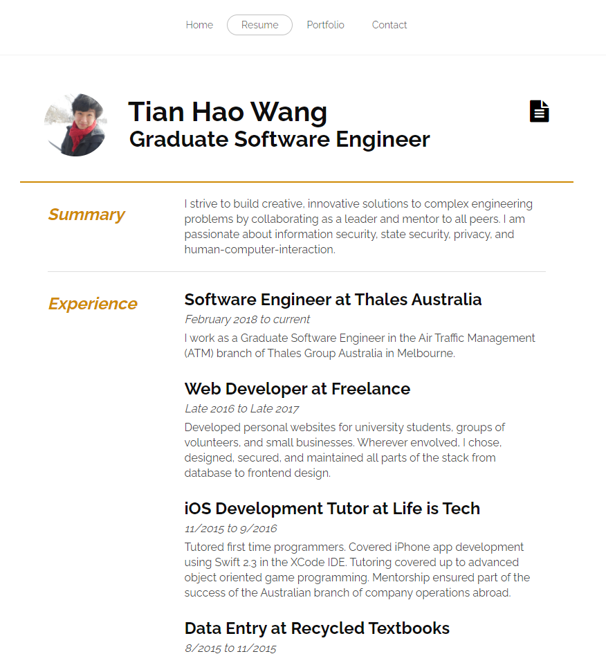
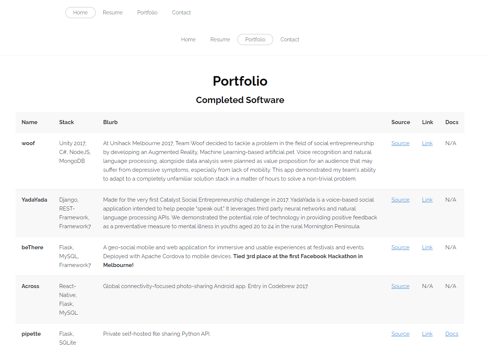
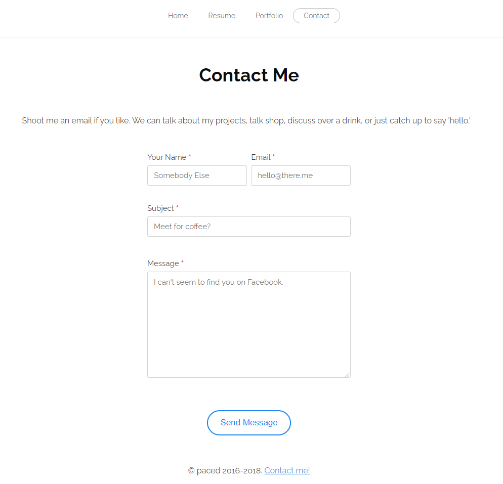

# paced.me

Source for my personal website.






## Requirements

- Python 3.9
- python-pip
- memcached (TODO: remove reliance)

## Usage

```sh
$ pip install -r requirements.txt
$ cd resume
```

## TODO

The biggest TODO is to make the site static. No need for it to have a server at all.
